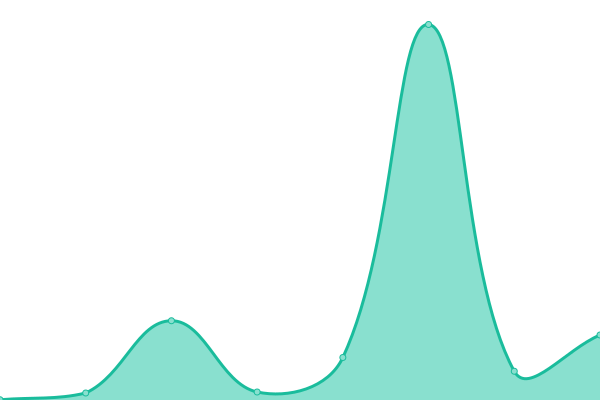

# [📈 Live Status](https://jonesyriffic.github.io/gsp-sst): <!--live status--> **🟧 Partial outage**

This repository contains the open-source uptime monitor and status page for [Andrew Jones](https://jonesyriffic.github.io/gsp-sst), powered by [Upptime](https://github.com/upptime/upptime).

With [Upptime](https://upptime.js.org), you can get your own unlimited and free uptime monitor and status page, powered entirely by a GitHub repository. We use [Issues](https://github.com/jonesyriffic/gsp-sst/issues) as incident reports, [Actions](https://github.com/jonesyriffic/gsp-sst/actions) as uptime monitors, and [Pages](https://jonesyriffic.github.io/gsp-sst) for the status page.

<!--start: status pages-->
<!-- This summary is generated by Upptime (https://github.com/upptime/upptime) -->
<!-- Do not edit this manually, your changes will be overwritten -->
<!-- prettier-ignore -->
| URL | Status | History | Response Time | Uptime |
| --- | ------ | ------- | ------------- | ------ |
|  [AD - Andorra](https://www.skyshowtime.com/ad/help/) | 🟥 Down | [ad-andorra.yml](https://github.com/jonesyriffic/gsp-sst/commits/HEAD/history/ad-andorra.yml) | 

 2248ms
     
 | 

<a href="https://jonesyriffic.github.io/gsp-sst/history/ad-andorra">95.85%</a>
    

|  [AL - Albania](https://www.skyshowtime.com/al/help/) | 🟩 Up | [al-albania.yml](https://github.com/jonesyriffic/gsp-sst/commits/HEAD/history/al-albania.yml) | 

 1701ms
     
 | 

<a href="https://jonesyriffic.github.io/gsp-sst/history/al-albania">96.10%</a>
    

|  [BA - Bosnia and Herzegovina](https://www.skyshowtime.com/ba/help/) | 🟥 Down | [ba-bosnia-and-herzegovina.yml](https://github.com/jonesyriffic/gsp-sst/commits/HEAD/history/ba-bosnia-and-herzegovina.yml) | 

 1587ms
     
 | 

<a href="https://jonesyriffic.github.io/gsp-sst/history/ba-bosnia-and-herzegovina">97.25%</a>
    

|  [BG - Bulgaria](https://www.skyshowtime.com/bg/help/) | 🟩 Up | [bg-bulgaria.yml](https://github.com/jonesyriffic/gsp-sst/commits/HEAD/history/bg-bulgaria.yml) | 

 1575ms
     
 | 

<a href="https://jonesyriffic.github.io/gsp-sst/history/bg-bulgaria">96.52%</a>
    

|  [CZ - Czechia](https://www.skyshowtime.com/cz/help/) | 🟩 Up | [cz-czechia.yml](https://github.com/jonesyriffic/gsp-sst/commits/HEAD/history/cz-czechia.yml) | 

 1597ms
     
 | 

<a href="https://jonesyriffic.github.io/gsp-sst/history/cz-czechia">98.11%</a>
    

|  [DK - Denmark](https://www.skyshowtime.com/dk/help/) | 🟩 Up | [dk-denmark.yml](https://github.com/jonesyriffic/gsp-sst/commits/HEAD/history/dk-denmark.yml) | 

 1215ms
     
 | 

<a href="https://jonesyriffic.github.io/gsp-sst/history/dk-denmark">97.17%</a>
    

|  [ES - Spain](https://www.skyshowtime.com/es/help/) | 🟩 Up | [es-spain.yml](https://github.com/jonesyriffic/gsp-sst/commits/HEAD/history/es-spain.yml) | 

 1050ms
     
 | 

<a href="https://jonesyriffic.github.io/gsp-sst/history/es-spain">95.02%</a>
    

|  [FI - Finland](https://www.skyshowtime.com/fi/help/) | 🟩 Up | [fi-finland.yml](https://github.com/jonesyriffic/gsp-sst/commits/HEAD/history/fi-finland.yml) | 

 1242ms
     
 | 

<a href="https://jonesyriffic.github.io/gsp-sst/history/fi-finland">93.86%</a>
    

|  [HR - Croatia](https://www.skyshowtime.com/hr/help/) | 🟩 Up | [hr-croatia.yml](https://github.com/jonesyriffic/gsp-sst/commits/HEAD/history/hr-croatia.yml) | 

 1462ms
     
 | 

<a href="https://jonesyriffic.github.io/gsp-sst/history/hr-croatia">97.41%</a>
    

|  [HU - Hungary](https://www.skyshowtime.com/hu/help/) | 🟥 Down | [hu-hungary.yml](https://github.com/jonesyriffic/gsp-sst/commits/HEAD/history/hu-hungary.yml) | 

 1632ms
     
 | 

<a href="https://jonesyriffic.github.io/gsp-sst/history/hu-hungary">96.67%</a>
    

|  [ME - Montenegro](https://www.skyshowtime.com/me/help/) | 🟥 Down | [me-montenegro.yml](https://github.com/jonesyriffic/gsp-sst/commits/HEAD/history/me-montenegro.yml) | 

 1624ms
     
 | 

<a href="https://jonesyriffic.github.io/gsp-sst/history/me-montenegro">96.51%</a>
    

|  [MK - Macedonia](https://www.skyshowtime.com/mk/help/) | 🟩 Up | [mk-macedonia.yml](https://github.com/jonesyriffic/gsp-sst/commits/HEAD/history/mk-macedonia.yml) | 

 1565ms
     
 | 

<a href="https://jonesyriffic.github.io/gsp-sst/history/mk-macedonia">97.62%</a>
    

|  [NL - Netherlands](https://www.skyshowtime.com/nl/help/) | 🟩 Up | [nl-netherlands.yml](https://github.com/jonesyriffic/gsp-sst/commits/HEAD/history/nl-netherlands.yml) | 

 1097ms
     
 | 

<a href="https://jonesyriffic.github.io/gsp-sst/history/nl-netherlands">97.44%</a>
    

|  [NO - Norway](https://www.skyshowtime.com/no/help/) | 🟩 Up | [no-norway.yml](https://github.com/jonesyriffic/gsp-sst/commits/HEAD/history/no-norway.yml) | 

 1420ms
     
 | 

<a href="https://jonesyriffic.github.io/gsp-sst/history/no-norway">96.59%</a>
    

|  [PL - Poland](https://www.skyshowtime.com/pl/help/) | 🟥 Down | [pl-poland.yml](https://github.com/jonesyriffic/gsp-sst/commits/HEAD/history/pl-poland.yml) | 

 1100ms
     
 | 

<a href="https://jonesyriffic.github.io/gsp-sst/history/pl-poland">96.06%</a>
    

|  [PT - Portugal](https://www.skyshowtime.com/pt/help/) | 🟥 Down | [pt-portugal.yml](https://github.com/jonesyriffic/gsp-sst/commits/HEAD/history/pt-portugal.yml) | 

 1447ms
     
 | 

<a href="https://jonesyriffic.github.io/gsp-sst/history/pt-portugal">95.58%</a>
    

|  [RO - Romania](https://www.skyshowtime.com/ro/help/) | 🟥 Down | [ro-romania.yml](https://github.com/jonesyriffic/gsp-sst/commits/HEAD/history/ro-romania.yml) | 

 1204ms
     
 | 

<a href="https://jonesyriffic.github.io/gsp-sst/history/ro-romania">96.82%</a>
    

|  [RS - Serbia](https://www.skyshowtime.com/rs/help/) | 🟩 Up | [rs-serbia.yml](https://github.com/jonesyriffic/gsp-sst/commits/HEAD/history/rs-serbia.yml) | 

 1565ms
     
 | 

<a href="https://jonesyriffic.github.io/gsp-sst/history/rs-serbia">95.55%</a>
    

|  [SE - Sweden](https://www.skyshowtime.com/se/help/) | 🟩 Up | [se-sweden.yml](https://github.com/jonesyriffic/gsp-sst/commits/HEAD/history/se-sweden.yml) | 

 1414ms
     
 | 

<a href="https://jonesyriffic.github.io/gsp-sst/history/se-sweden">95.47%</a>
    

|  [SI - Slovenia](https://www.skyshowtime.com/si/help/) | 🟥 Down | [si-slovenia.yml](https://github.com/jonesyriffic/gsp-sst/commits/HEAD/history/si-slovenia.yml) | 

 1491ms
     
 | 

<a href="https://jonesyriffic.github.io/gsp-sst/history/si-slovenia">97.24%</a>
    

|  [SK - Slovakia](https://www.skyshowtime.com/dk/help/) | 🟩 Up | [sk-slovakia.yml](https://github.com/jonesyriffic/gsp-sst/commits/HEAD/history/sk-slovakia.yml) | 

 560ms
     
 | 

<a href="https://jonesyriffic.github.io/gsp-sst/history/sk-slovakia">99.46%</a>
    

|  [XK - Kosovo](https://www.skyshowtime.com/xk/help/) | 🟩 Up | [xk-kosovo.yml](https://github.com/jonesyriffic/gsp-sst/commits/HEAD/history/xk-kosovo.yml) | 

 1707ms
     
 | 

<a href="https://jonesyriffic.github.io/gsp-sst/history/xk-kosovo">96.12%</a>
    

<!--end: status pages-->

[**Visit our status website →**](https://jonesyriffic.github.io/gsp-sst)

## 📄 License

- Powered by: [Upptime](https://github.com/upptime/upptime)
- Code: [MIT](./LICENSE) © [Anand Chowdhary](https://anandchowdhary.com), supported by [Pabio](https://pabio.com)
- Data in the `./history` directory: [Open Database License](https://opendatacommons.org/licenses/odbl/1-0/)
